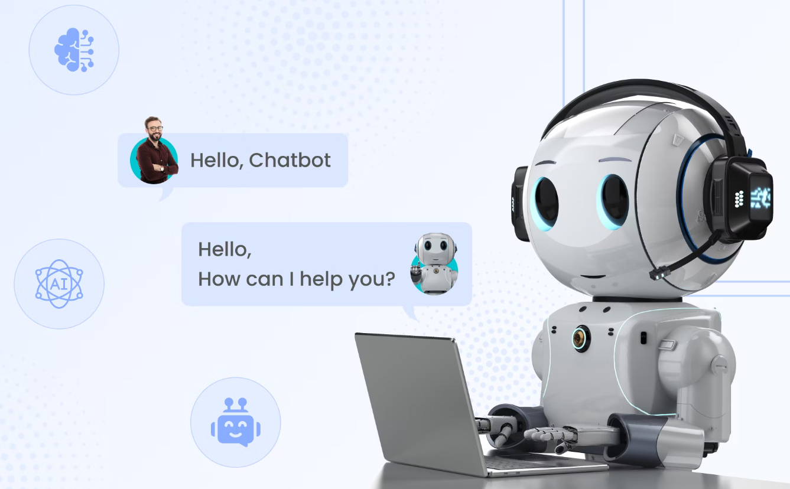

# Chatbot

  

## Table of Contents <!-- omit from toc -->
- [Basic_Programming_Practice_Project](#Basic_Programming_Practice_Project)
- [After_the_Basic_Programming_Practice](#After_the_Basic_Programming_Practice)
  
## Basic_Programming_Practice_Project

In this project, we tested and practiced the basics of programming using a simple chatbot implementation. The goal was to explore fundamental concepts such as:
- Variables and data types
- Conditional statements (if, else, elif)
- Loops (for, while)
- Functions and modular code
- Input/output handling
- Basic error checking
- Simple logic and control flow

To make learning more interactive and practical, we implemented a basic chatbot that simulates a conversation with a user. The chatbot can answer simple questions, respond to greetings, and demonstrate how programming logic can be used to build user-friendly applications.

This project helped build a strong foundation for more advanced programming topics by applying concepts in a hands-on and engaging way.

## After_the_Basic_Programming_Practice
After completing the basic programming exercises, we focused on applying our skills to a more structured project. We enhanced the chatbot step by step by adding new features and improving its interaction logic. This included:
- Expanding the chatbot’s response capabilities with more conditions
- Using functions to make the code more modular and reusable
- Introducing data structures like lists and dictionaries to manage possible responses
- Adding loops to maintain the chat until the user wants to exit
- Handling invalid input and improving the chatbot's robustness
  
We also began thinking in terms of user experience, trying to make the chatbot not only functional but also a bit more natural and friendly.
This second phase marked the transition from simply writing code that “works” to writing code that is well-structured, readable, and maintainable.
